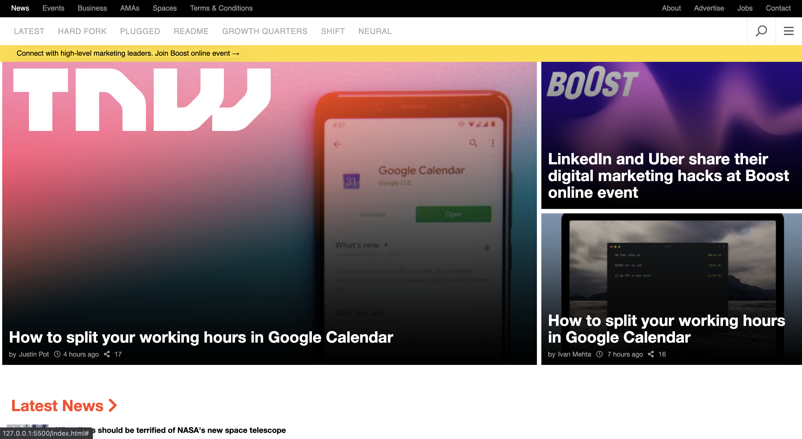

# TNW | Responsive | HTML & CSS

> This project is a clone of the TNW page, which has been the task for week 2 of microverse. Inclding and meeting all the external and internal requirements of the project. It covers basic html and css concepts including positioning, flex box, grid and float.



## Built With

- Html + Css

## Live Demo Of The Project

[Live Demo Link](https://uzairali19.github.io/perma-tnw-responsive/)


## Getting Started

To get a local copy up and running follow these simple example steps.

### Prerequisites

Git
Node, Node package Manager

### Setup Local

Use 

```
git clone -b responsive-test https://github.com/uzairali19/perma-tnw-responsive.git
```
to clone the branch directly to your machine

For Linters:

```
npm install --save-dev hint@6.0.x
```

```
npm install --save-dev stylelint@13.3.x stylelint-scss@3.17.x stylelint-config-standard@20.0.x stylelint-csstree-validator
```
### Usage

This is used for learning purposes. Feel free to collaborate.

### Run tests

To locally run tests using html and css linters.

Use:

For HTML:
```
npx hint .
```

For CSS:
```
npx stylelint "**/*.{css,scss}" 
```
### Deployment

Make a pull request if your want to contribute. Thanks.

## Authors

👤 **Uzair*Ali**

- GitHub: [Uzair Ali](https://github.com/uzairali19)
- LinkedIn: [Uzair Ali](https://www.linkedin.com/in/uzair-ali-964187166/)

## 🤝 Contributing

Contributions, issues, and feature requests are welcome!

Feel free to raise an issue on the [issues page](https://github.com/uzairali19/perma-tnw-responsive/issues).

## Show your support

Please. Give a ⭐️ if you like this project!